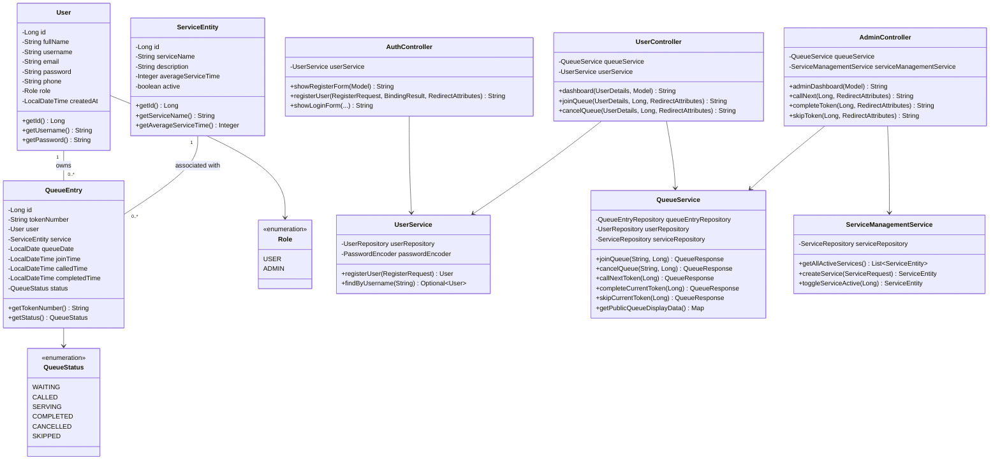

# Class Diagram
## Smart Queue Management System

---

## 1. System Class Diagram (Mermaid Notation)

```mermaid
classDiagram
    class User {
        -Long id
        -String fullName
        -String username
        -String email
        -String password
        -String phone
        -Role role
        -LocalDateTime createdAt
        +getId() Long
        +getUsername() String
        +getPassword() String
    }

    class ServiceEntity {
        -Long id
        -String serviceName
        -String description
        -Integer averageServiceTime
        -boolean active
        +getId() Long
        +getServiceName() String
        +getAverageServiceTime() Integer
    }

    class QueueEntry {
        -Long id
        -String tokenNumber
        -User user
        -ServiceEntity service
        -LocalDate queueDate
        -LocalDateTime joinTime
        -LocalDateTime calledTime
        -LocalDateTime completedTime
        -QueueStatus status
        +getTokenNumber() String
        +getStatus() QueueStatus
    }

    class Role {
        <<enumeration>>
        USER
        ADMIN
    }

    class QueueStatus {
        <<enumeration>>
        WAITING
        CALLED
        SERVING
        COMPLETED
        CANCELLED
        SKIPPED
    }

    class UserService {
        -UserRepository userRepository
        -PasswordEncoder passwordEncoder
        +registerUser(RegisterRequest) User
        +findByUsername(String) Optional~User~
    }

    class QueueService {
        -QueueEntryRepository queueEntryRepository
        -UserRepository userRepository
        -ServiceRepository serviceRepository
        +joinQueue(String, Long) QueueResponse
        +cancelQueue(String, Long) QueueResponse
        +callNextToken(Long) QueueResponse
        +completeCurrentToken(Long) QueueResponse
        +skipCurrentToken(Long) QueueResponse
        +getPublicQueueDisplayData() Map
    }

    class ServiceManagementService {
        -ServiceRepository serviceRepository
        +getAllActiveServices() List~ServiceEntity~
        +createService(ServiceRequest) ServiceEntity
        +toggleServiceActive(Long) ServiceEntity
    }

    class AuthController {
        -UserService userService
        +showRegisterForm(Model) String
        +registerUser(RegisterRequest, BindingResult, RedirectAttributes) String
        +showLoginForm(...) String
    }

    class UserController {
        -QueueService queueService
        -UserService userService
        +dashboard(UserDetails, Model) String
        +joinQueue(UserDetails, Long, RedirectAttributes) String
        +cancelQueue(UserDetails, Long, RedirectAttributes) String
    }

    class AdminController {
        -QueueService queueService
        -ServiceManagementService serviceManagementService
        +adminDashboard(Model) String
        +callNext(Long, RedirectAttributes) String
        +completeToken(Long, RedirectAttributes) String
        +skipToken(Long, RedirectAttributes) String
    }

    User "1" -- "0..*" QueueEntry : owns
    ServiceEntity "1" -- "0..*" QueueEntry : associated with
    User --> Role
    QueueEntry --> QueueStatus

    AuthController --> UserService
    UserController --> QueueService
    UserController --> UserService
    AdminController --> QueueService
    AdminController --> ServiceManagementService
```
