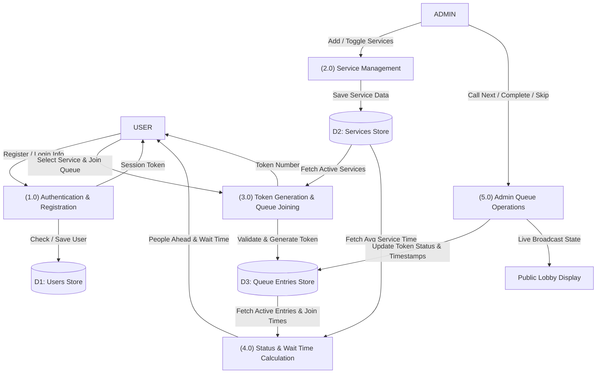

# Data Flow Diagrams (DFD)
## Smart Queue Management System

---

## 1. Level-0 DFD (Context Diagram)

```mermaid
graph TD
    User["USER (Student/Visitor)"] -->|Registration Request / Login Credentials / Join Queue Request / Cancel Token| System["(0.0) Smart Queue Management System"]
    Admin["ADMIN (Counter Staff)"] -->|Login Credentials / Add & Edit Services / Call Next / Complete / Skip| System

    System -->|Token Status / Waiting Time / Queue History| User
    System -->|Queue Statistics / Today Log / Live Counter State| Admin
    System -->|Live Now Serving & Next Tokens (AJAX)| LobbyDisplay["Public Lobby TV Display"]
```

---

## 2. Level-1 DFD (Detailed Process Breakdown)



---

## 3. Data Stores Description

| Data Store | Entity Name | Stored Information | Primary Key |
|---|---|---|---|
| D1 | Users Store (`users`) | User ID, Full Name, Username, Email, Encrypted Password, Phone, Role, Created Timestamp | `id` |
| D2 | Services Store (`services`) | Service ID, Name, Description, Avg Service Time, Active Flag | `id` |
| D3 | Queue Entries Store (`queue_entries`) | Queue ID, Token Number, User ID (FK), Service ID (FK), Queue Date, Join Time, Called Time, Completed Time, Status | `id` |
