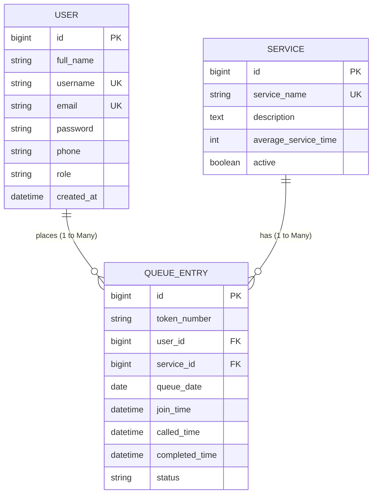

# Entity-Relationship Diagram (ERD)
## Smart Queue Management System

---

## 1. ER Diagram (Mermaid Notation)

---

## 2. Entity Descriptions & Foreign Key Mapping

### 2.1 USER Entity (`users` Table)
- `id` (BIGINT, Primary Key, Auto-Increment): Unique identifier for each registered user.
- `full_name` (VARCHAR(255), NOT NULL): User's complete name.
- `username` (VARCHAR(255), UNIQUE, NOT NULL): Account login handle.
- `email` (VARCHAR(255), UNIQUE, NOT NULL): Registered email address.
- `password` (VARCHAR(255), NOT NULL): BCrypt hashed password string.
- `phone` (VARCHAR(255), NOT NULL): Contact phone number.
- `role` (VARCHAR(50), NOT NULL): Enum (`USER`, `ADMIN`).
- `created_at` (DATETIME, NOT NULL): Timestamp of account creation.

### 2.2 SERVICE Entity (`services` Table)
- `id` (BIGINT, Primary Key, Auto-Increment): Unique service identifier.
- `service_name` (VARCHAR(255), UNIQUE, NOT NULL): Service title (e.g. Admission, Fees).
- `description` (TEXT): Detailed description of counter activities.
- `average_service_time` (INT, NOT NULL): Estimated service duration in minutes per student.
- `active` (BOOLEAN, NOT NULL): Service availability flag (`true`/`false`).

### 2.3 QUEUE_ENTRY Entity (`queue_entries` Table)
- `id` (BIGINT, Primary Key, Auto-Increment): Unique token record ID.
- `token_number` (VARCHAR(255), NOT NULL): Dynamic token number (e.g. `ADM-001`).
- `user_id` (BIGINT, Foreign Key -> `users.id`): References the user who requested the token.
- `service_id` (BIGINT, Foreign Key -> `services.id`): References the target service counter.
- `queue_date` (DATE, NOT NULL): Date for daily reset numbering.
- `join_time` (DATETIME, NOT NULL): Exact timestamp student joined the queue.
- `called_time` (DATETIME): Timestamp when admin clicked Call Next.
- `completed_time` (DATETIME): Timestamp when service was completed.
- `status` (VARCHAR(50), NOT NULL): Enum (`WAITING`, `CALLED`, `SERVING`, `COMPLETED`, `CANCELLED`, `SKIPPED`).
