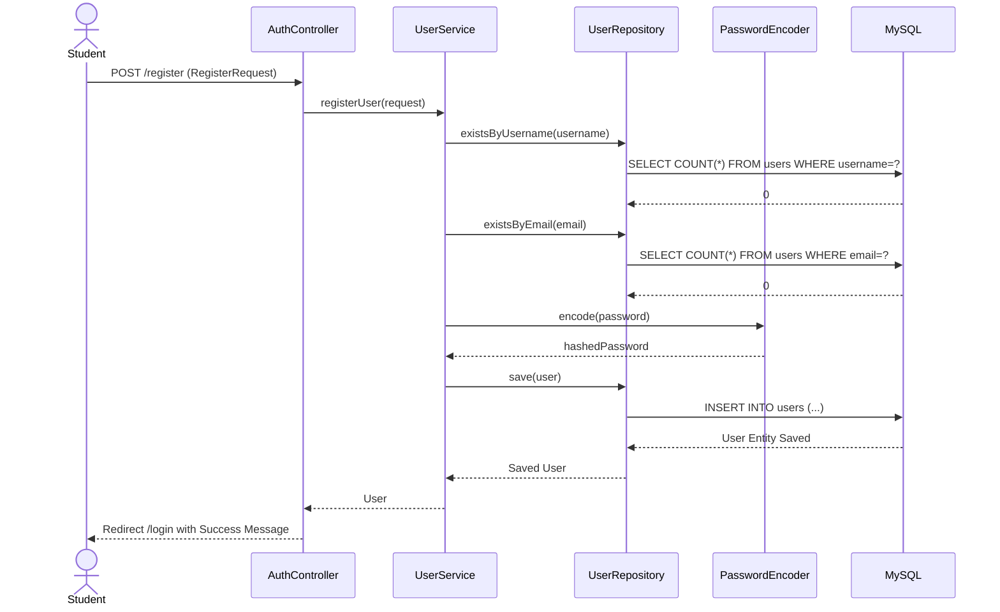
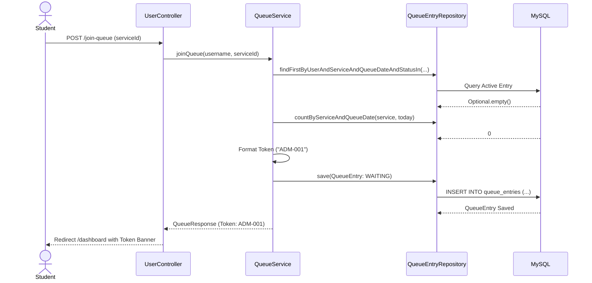
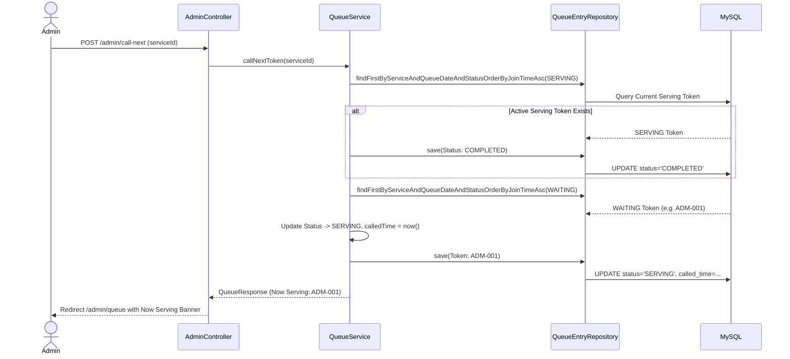

# Sequence Diagrams
## Smart Queue Management System

---

## 1. User Registration Sequence

```mermaid
sequenceDiagram
    actor Student
    participant AuthController
    participant UserService
    participant UserRepository
    participant PasswordEncoder
    participant MySQL

    Student->>AuthController: POST /register (RegisterRequest)
    AuthController->>UserService: registerUser(request)
    UserService->>UserRepository: existsByUsername(username)
    UserRepository->>MySQL: SELECT COUNT(*) FROM users WHERE username=?
    MySQL-->>UserRepository: 0
    UserService->>UserRepository: existsByEmail(email)
    UserRepository->>MySQL: SELECT COUNT(*) FROM users WHERE email=?
    MySQL-->>UserRepository: 0
    UserService->>PasswordEncoder: encode(password)
    PasswordEncoder-->>UserService: hashedPassword
    UserService->>UserRepository: save(user)
    UserRepository->>MySQL: INSERT INTO users (...)
    MySQL-->>UserRepository: User Entity Saved
    UserRepository-->>UserService: Saved User
    UserService-->>AuthController: User
    AuthController-->>Student: Redirect /login with Success Message
```

---

## 2. Join Queue Sequence

```mermaid
sequenceDiagram
    actor Student
    participant UserController
    participant QueueService
    participant QueueEntryRepository
    participant MySQL

    Student->>UserController: POST /join-queue (serviceId)
    UserController->>QueueService: joinQueue(username, serviceId)
    QueueService->>QueueEntryRepository: findFirstByUserAndServiceAndQueueDateAndStatusIn(...)
    QueueEntryRepository->>MySQL: Query Active Entry
    MySQL-->>QueueEntryRepository: Optional.empty()
    QueueService->>QueueEntryRepository: countByServiceAndQueueDate(service, today)
    MySQL-->>QueueEntryRepository: 0
    QueueService->>QueueService: Format Token ("ADM-001")
    QueueService->>QueueEntryRepository: save(QueueEntry: WAITING)
    QueueEntryRepository->>MySQL: INSERT INTO queue_entries (...)
    MySQL-->>QueueEntryRepository: QueueEntry Saved
    QueueService-->>UserController: QueueResponse (Token: ADM-001)
    UserController-->>Student: Redirect /dashboard with Token Banner
```

---

## 3. Admin Call Next Token Sequence

```mermaid
sequenceDiagram
    actor Admin
    participant AdminController
    participant QueueService
    participant QueueEntryRepository
    participant MySQL

    Admin->>AdminController: POST /admin/call-next (serviceId)
    AdminController->>QueueService: callNextToken(serviceId)
    QueueService->>QueueEntryRepository: findFirstByServiceAndQueueDateAndStatusOrderByJoinTimeAsc(SERVING)
    QueueEntryRepository->>MySQL: Query Current Serving Token
    Alt Active Serving Token Exists
        MySQL-->>QueueEntryRepository: SERVING Token
        QueueService->>QueueEntryRepository: save(Status: COMPLETED)
        QueueEntryRepository->>MySQL: UPDATE status='COMPLETED'
    End
    QueueService->>QueueEntryRepository: findFirstByServiceAndQueueDateAndStatusOrderByJoinTimeAsc(WAITING)
    MySQL-->>QueueEntryRepository: WAITING Token (e.g. ADM-001)
    QueueService->>QueueService: Update Status -> SERVING, calledTime = now()
    QueueService->>QueueEntryRepository: save(Token: ADM-001)
    QueueEntryRepository->>MySQL: UPDATE status='SERVING', called_time=...
    QueueService-->>AdminController: QueueResponse (Now Serving: ADM-001)
    AdminController-->>Admin: Redirect /admin/queue with Now Serving Banner
```
